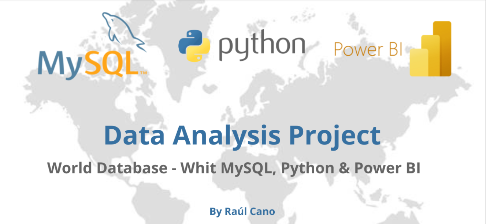

🌍 Proyecto Integrador – Datos Mundiales

Este proyecto forma parte del Programa de Analista de Datos de Unicorn Academy y representa la integración final de todas las competencias desarrolladas a lo largo del curso: modelado de datos, consultas SQL, análisis exploratorio con Python y visualización en Power BI.

🎯 Objetivo

Analizar información global de países, ciudades e idiomas aplicando herramientas de análisis de datos para obtener insights sobre población, densidad, esperanza de vida y diversidad lingüística.
El propósito fue recorrer todo el proceso analítico completo: desde la extracción y modelado de datos hasta la visualización interactiva.

🧰 Stack Tecnológico
Herramienta	Rol principal
🐬 MySQL	Normalización de tablas, creación de claves primarias y foráneas, índices, vistas analíticas y optimización de consultas.
🐍 Python (Jupyter Notebook)	Conexión a la base con SQLAlchemy, análisis exploratorio, visualización de datos y análisis estadístico.
📊 Power BI	Dashboard interactivo para representar indicadores clave y explorar visualmente las relaciones entre variables.

🧩 Estructura del proyecto
```
Proyecto_Integrador_Datos_Mundiales/
├── world_con_correcciones.sql
├── Proyecto_Integrador_Datos_Mundiales.ipynb
├── Datos_Mundiales.pbix
└── README.md
```

📊 Principales análisis y visualizaciones

- Población total por continente y distribución porcentual.
- Densidad poblacional y su correlación con superficie y esperanza de vida.
- Idiomas oficiales por continente y porcentaje de cobertura por país.
- Ciudades con más de 5 millones de habitantes.
- Histograma de esperanza de vida en países con más de 75 años promedio.

🔍 Desafíos y aprendizajes

El principal desafío fue mantener la coherencia entre los distintos entornos (SQL, Python y Power BI), asegurando la consistencia de los datos y optimizando el rendimiento de las consultas.
Durante la revisión con el profesor, se realizaron mejoras estructurales —como la implementación del formato snake_case, la creación de índices y vistas— que fortalecieron el modelo y facilitaron el análisis.

🚀 Resultados

El proyecto entrega una visión integral del ciclo analítico: desde el modelado relacional hasta la interpretación visual de los datos.
Refleja la capacidad de integrar herramientas y aplicar pensamiento analítico para transformar información cruda en conocimiento útil.

🏁 Créditos

Desarrollado por Raúl Cano
📚 Programa Analista de Datos – Unicorn Academy

📎 Enlaces

🔗 Publicación en LinkedIn https://www.linkedin.com/posts/ra%C3%BAl-cano-752123322_dataanalytics-sql-python-activity-7386576291837296640-1N4v?utm_source=share&utm_medium=member_desktop&rcm=ACoAAFGIJm4B39xrlvTf72_53YJJbENDtT3lMEY

📥 Archivos disponibles en este repositorio.
